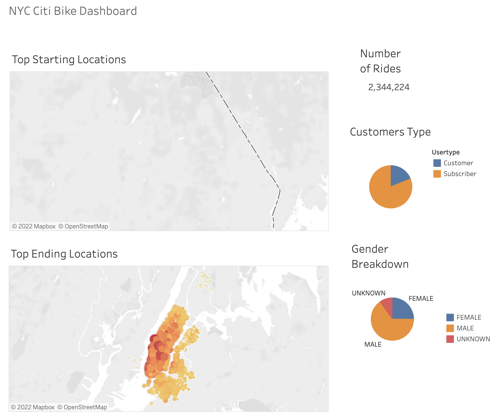
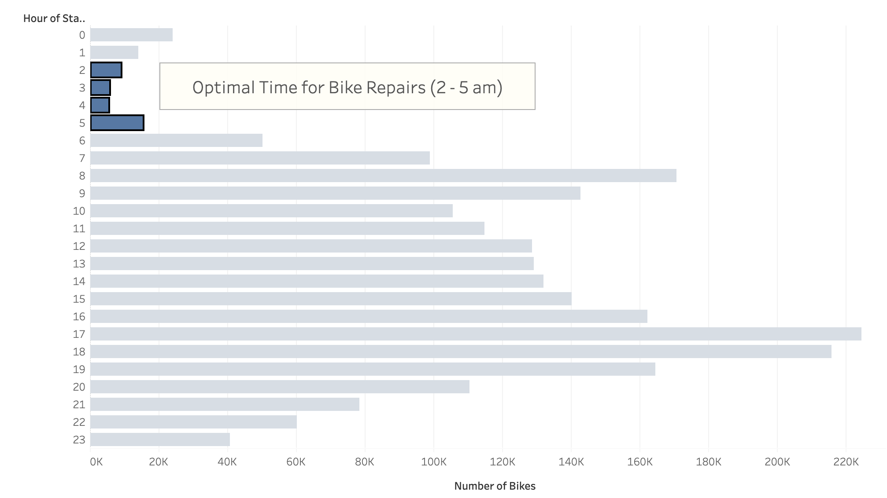
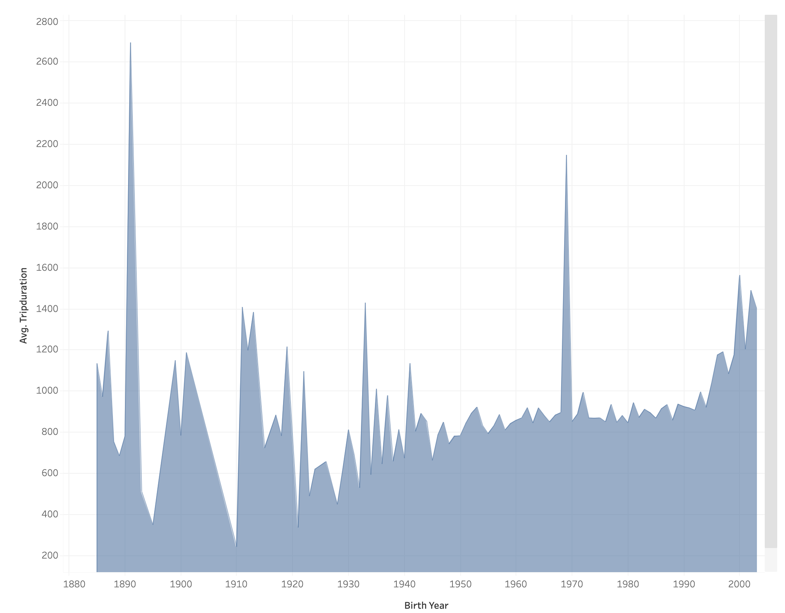
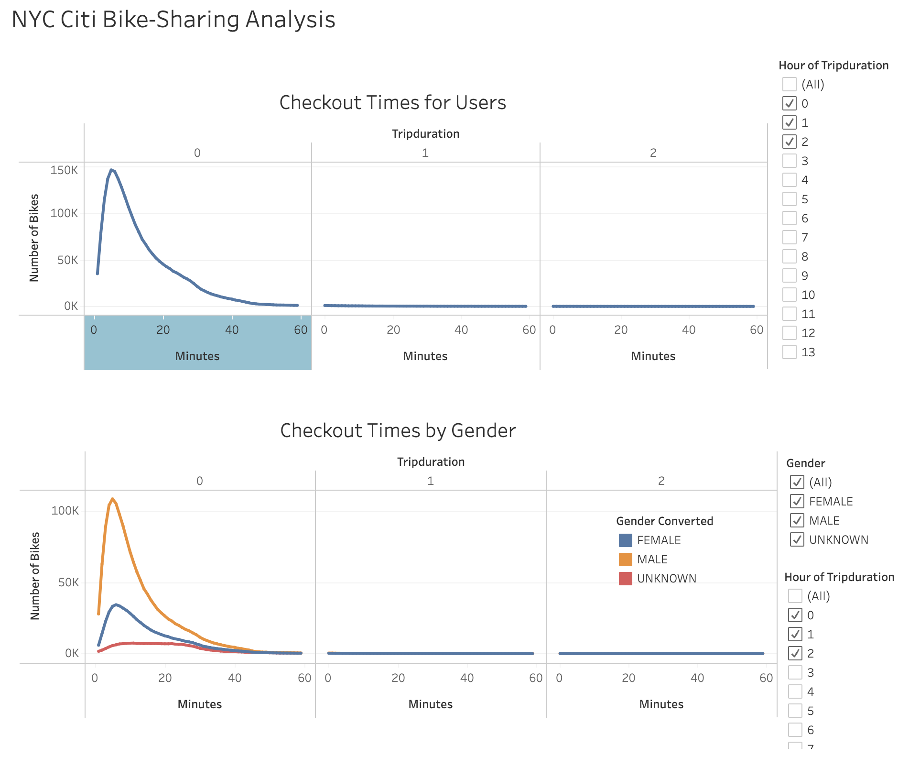
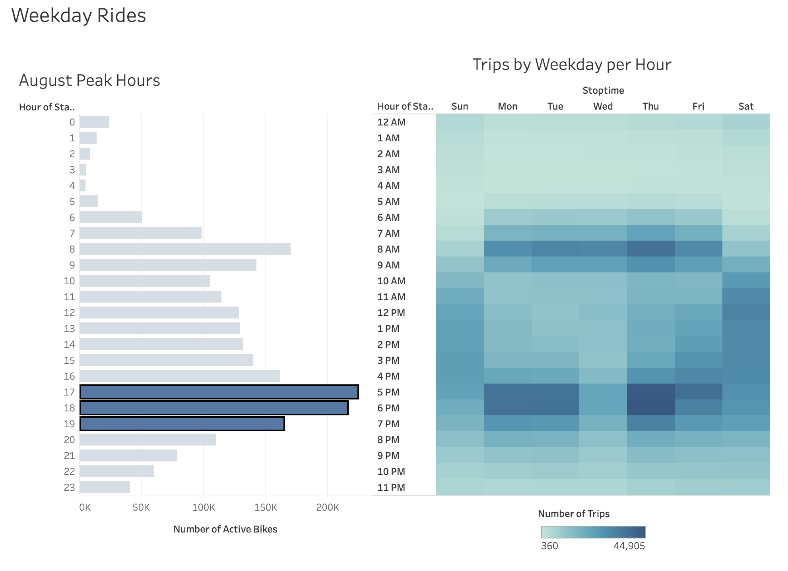
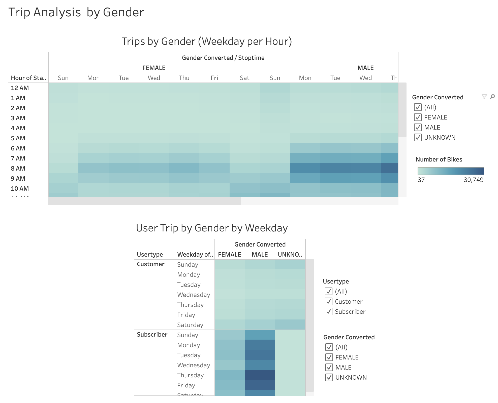

# Bikesharing
NYC Citibike with Tableau

## Overview 
***Background***

Inspired by a recent trip to NYC, we are interested in starting up a similar bikesharing business for the state of Des Moines, Iowa.  Although Des Moines and New York City are vastly different, we decide to brainstorm ideas on how this potential business may work by first looking at how it works in NYC. To figure out how a bikesharing company might work in Iowa, we first need to pull data from a bike sharing company in NYC to understand the logistics. 

We specifically need to answer the following questions for a business proposal to a potential investor: 

- What type of customers use bikeshare programs? 
- Where are the most popular places for bikesharing? 
- How long are bikes being used? And by which customers? 

***Purpose***

The purpose of this analysis is to use Tableau to create visualizations to tell a story of how Bikesharing works in NYC using real-world bikesharing data. 

## Resources 
- Original Data Source: [Citi Bike Trip Histories From August 2019](https://ride.citibikenyc.com/system-data)
- Software: Tableau Public, Pandas, Jupyter Notebook 


## Results
### Links: 
- [NYC Citi Bike-Sharing Dashboard](https://public.tableau.com/app/profile/meghan.koon/viz/Module_15_16696632827210/NYCCitiBikeStory?publish=yes)
- [NYC Citi Bike-Sharing Analysis](https://public.tableau.com/app/profile/meghan.koon/viz/NYCCitiBikeSharingAnalysis_16698551962160/NYCCitiBikeSharingAnalysis?publish=yes)

### Data Analysis
Before creating additional visualizations for the Trip Analysis, we first had to change the Trip Duration to a Datetime format using Pandas and Jupyter notebook. To do so, we imported the data's csv, read it as a Pandas DataFrame, then converted the Tripduration column from int to a datetime format: 
```
# 3. Convert the 'tripduration' column to datetime datatype.
citibike_df["tripduration"] = pd.to_datetime(citibike_df["tripduration"], unit="s")
```

From the two Tableau Stories ([NYC Citi Bike-Sharing Dashboard](https://public.tableau.com/app/profile/meghan.koon/viz/Module_15_16696632827210/NYCCitiBikeStory?publish=yes) & [NYC Citi Bike-Sharing Analysis](https://public.tableau.com/app/profile/meghan.koon/viz/NYCCitiBikeSharingAnalysis_16698551962160/NYCCitiBikeSharingAnalysis?publish=yes)), we are able to analyze the data from NYC to see how it could possibly work in Des Moines, Iowa. Our findings are as follows: 

1. From the screenshot below, we can see the types of customers who use bikesharing programs like CitiBike. More than 3/4 of the total riders are Subscribers and Male. From the Top Starting/ Ending Locations map, we can see that the Size of the circles and the darker circles portray the number of trips that started in those locations. From the color and size of the circles, we see that there is an increase in usage in the lower part of NYC. Bike usage is overall more used in the city vs. surrounding neighborhoods. 



2. From August Peak Hours chart, the bar graph displays the total rides in August per hour of the day. We see that the Peak hours for bike riders and from 5 - 7 pm. We also see that from 2 - 5 am is when bikes are not being used as much. This would be an opportune time for the company to do bike repairs. 



3. From this area chart, we see the Birth Year on the x-axis and Average Trip Duration in Minutes on the y-axis. In general, the younger bike users ride for a longer period of time (specifically those who were born in 1970 or later). 



4. After changing the Tripduration units to a datetime format, we are now able to analyze the different amounts of times each bike was checked out. From the line graphs below, we see that the most of rides were under 60 minutes (1 hr) - specifically under 30 minutes or less. From the Checkout Times by Gender graph, we see that again - Males are the primary users of this bikesharing program. 



5. We know that the Peak Times for riding in August are from 5 - 7 pm. Looking further into our data, we are able to create a Heat Map that shows the Number of Trips by Weekday Per Hour. The darker the color, the more trips were taken. This heatmap also confirms that the prime time during the weekdays are in the mornings from 8-9 am and in the afternoons from 5-7 pm. We also see that on the weekends (Saturday and Sunday), there are riders who like to ride from around 10 - 7 pm. 



6. Lastly, from these two charts we see the Trips by Gender and User Trips by Gender by Weekday. From the first chart, it is confirmed that there are more male riders. From the second chart, we can see that the main income source of this company is again from males who are subscribers. 



## Summary 


